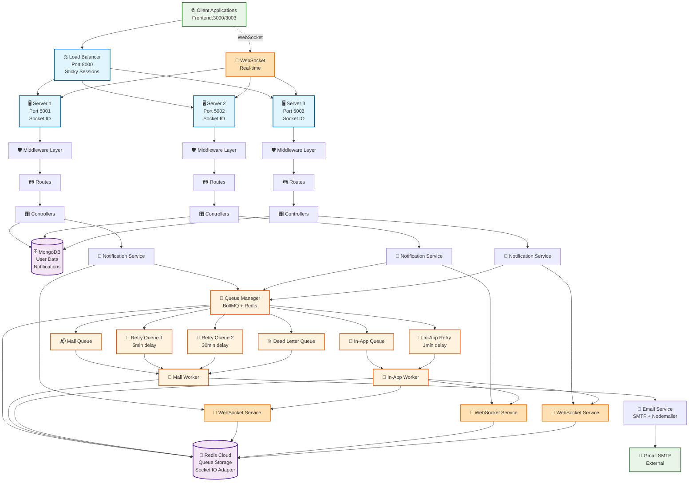

# 📋 Notification System Backend Architecture

## 🏗️ System Overview
A **distributed real-time notification system** built with Node.js, Express, MongoDB, Redis, BullMQ, and Socket.IO featuring load balancing, email processing, WebSocket-based real-time notifications, and comprehensive delivery tracking.

---

## 📁 Directory Structure

```
backend/
├── 📂 config/
│   ├── db.js                    # MongoDB connection configuration
│   └── index.js                 # Central configuration (Redis, servers, queues, CORS)
│
├── 📂 constants/
│   └── index.js                 # System constants (statuses, types, enums)
│
├── 📂 controllers/
│   ├── friendRequest.controller.js
│   ├── login.controller.js      # Login tracking with notification triggers
│   ├── purchase.controller.js
│   ├── resetPassword.controller.js
│   ├── session.controller.js    # Session management
│   └── signup.controller.js     # Main signup logic with email tracking
│
├── 📂 load-balancer/
│   └── server.js                # Load balancer with sticky sessions & round-robin
│
├── 📂 middleware/
│   ├── auth.js                  # Authentication & request preprocessing
│   ├── errorHandler.js          # Global error handling
│   └── validation.js            # Request validation middleware
│
├── 📂 models/
│   ├── emailNotification.model.js  # Email delivery tracking
│   ├── friendRequests.model.js
│   ├── inAppNotification.model.js  # In-app notification tracking
│   ├── logins.model.js          # Login records with notification status
│   ├── purchases.model.js
│   ├── resetPasswords.model.js
│   └── signups.model.js         # User signups with email status tracking
│
├── 📂 queues/
│   └── index.js                 # BullMQ queue management (mail, retry, dlq, inapp)
│
├── 📂 routes/
│   ├── friendRequest.routes.js
│   ├── health.routes.js         # Health check endpoints
│   ├── index.js                 # Route aggregation
│   ├── login.routes.js          # Login endpoints
│   ├── purchase.routes.js
│   ├── resetPassword.routes.js
│   ├── session.routes.js        # Session management endpoints
│   └── signup.routes.js
│
├── 📂 servers/
│   ├── server1.js               # Backend server instance 1 (WebSocket enabled)
│   ├── server2.js               # Backend server instance 2 (WebSocket enabled)
│   └── server3.js               # Backend server instance 3 (WebSocket enabled)
│
├── 📂 services/
│   ├── emailService.js          # SMTP email delivery service
│   ├── notificationService.js   # Core notification orchestration
│   └── websocketService.js      # WebSocket real-time notification service
│
├── 📂 utils/
│   └── logger.js                # Centralized logging utility
│
├── 📂 workers/
│   ├── inAppWorker.js           # In-app notification processor
│   └── mailWorker.js            # BullMQ email processing worker
│
├── .env                         # Environment configuration
├── check-status.js              # System status checker utility
├── package.json                 # Dependencies and scripts
└── ARCHITECTURE.md              # This documentation
```

---

## 🏛️ System Architecture Diagram



---

## 🔄 Data Flow Architecture

### 1. **Request Processing Flow**
```
Client Request → Load Balancer → Server Instance → Middleware → Routes → Controllers → Models → Database
```

### 2. **Email Notification Processing Flow**
```
Controller → Notification Service → Queue Manager → Mail Queue → Mail Worker → Email Service → SMTP → Delivery
```

### 3. **Real-time In-App Notification Flow**
```
Controller → Notification Service → Queue Manager → In-App Queue → In-App Worker → WebSocket Service → Socket.IO → Client
```

### 4. **WebSocket Connection Flow**
```
Client → Socket.IO → Server (Sticky Session) → Authentication → User Room Join → Real-time Events
```

### 5. **Retry Mechanism Flow**
```
Failed Email → Retry Queue 1 (5min) → Retry Queue 2 (30min) → Dead Letter Queue → Manual Review
Failed In-App → In-App Retry Queue (1min) → Dead Letter Queue → Manual Review
```

---

## 🗃️ Database Schema

### **MongoDB Collections**

#### **Signups Collection**
```javascript
{
  userId: Number,           // Unique user identifier
  username: String,         // User's chosen username
  email: String,           // User's email address
  password: String,        // Hashed password
  emailVerified: Boolean,  // Email verification status
  welcomeEmail: {          // Email tracking object
    status: String,        // pending|queued|sending|delivered|failed
    attempts: Number,      // Delivery attempt count
    messageId: String,     // Email message ID
    deliveryHistory: []    // Complete delivery audit trail
  },
  createdAt: Date,
  updatedAt: Date
}
```

#### **Logins Collection**
```javascript
{
  userId: Number,          // User identifier
  username: String,        // Username
  email: String,          // Email address
  loginSuccessful: Boolean,
  sessionToken: String,
  loginAlertEmail: {      // Email notification tracking
    status: String,
    jobId: String,
    notificationId: String,
    deliveryHistory: []
  },
  loginInAppNotification: { // In-app notification tracking
    status: String,
    jobId: String,
    notificationId: String,
    deliveryHistory: []
  },
  createdAt: Date
}
```

#### **InAppNotification Collection**
```javascript
{
  type: String,            // Notification type
  recipient: {
    userId: Number,
    username: String,
    email: String
  },
  title: String,          // Notification title
  message: String,        // Notification message
  status: String,         // pending|delivered|failed|expired
  priority: String,       // low|normal|high|urgent
  attempts: Number,       // Delivery attempts
  deliveredAt: Date,      // When delivered via WebSocket
  socketId: String,       // Socket ID that received it
  expiresAt: Date,       // Expiration time
  createdAt: Date
}
```

#### **EmailNotification Collection**
```javascript
{
  type: String,            // signup|login|reset_password|purchase|friend_request
  recipient: Object,       // Email recipient details
  status: String,          // pending|processing|delivered|failed
  attempts: Number,        // Delivery attempts
  retryHistory: [],        // Retry tracking
  messageId: String,       // SMTP message ID
  createdAt: Date
}
```

---

## 🔧 Key Technologies

| Technology | Purpose | Configuration |
|------------|---------|---------------|
| **Node.js + Express** | Web framework | 3 server instances with WebSocket support |
| **Socket.IO** | Real-time bidirectional communication | WebSocket + fallback transports |
| **MongoDB + Mongoose** | Database | User data & notification tracking |
| **Redis Cloud** | Multiple purposes | Queue storage + Socket.IO adapter |
| **BullMQ** | Job queue system | Mail & in-app notification processing |
| **Nodemailer** | Email delivery | Gmail SMTP |
| **Load Balancer** | Traffic distribution | Round-robin with sticky sessions |

---

## ⚡ Key Features

### **🔌 Real-time WebSocket Features**
- **Socket.IO Integration**: Real-time bidirectional communication
- **Redis Adapter**: Multi-server WebSocket synchronization
- **User Authentication**: Secure WebSocket connections
- **Room-based Broadcasting**: Targeted user notifications
- **Auto-reconnection**: Resilient connection handling
- **Connection State Management**: Track online users

### **🔄 Queue Architecture**
- **Mail Queue**: Primary email processing
- **In-App Queue**: Real-time notification processing
- **Retry Queue 1**: 5-minute delayed retries  
- **Retry Queue 2**: 30-minute delayed retries
- **In-App Retry Queue**: 1-minute delayed retries
- **Dead Letter Queue**: Failed message handling

### **📊 Notification Tracking**
- Real-time delivery status updates
- Complete delivery history audit trail
- Dual-channel notifications (Email + In-App)
- Failure reason tracking
- SMTP response logging
- WebSocket delivery confirmation

### **🚀 High Availability**
- Load-balanced across 3 server instances
- Sticky sessions for WebSocket connections
- Shared Redis connection pooling
- Graceful error handling and recovery
- Health monitoring endpoints
- Auto-failover capabilities

### **🔒 Security Features**
- Input validation and sanitization
- CORS configuration for multiple origins
- Error handling middleware
- Request logging and monitoring
- Server identification headers
- Session-based authentication

---

## 🚦 API Endpoints

### **Health & Monitoring**
```
GET  /api/health                    # System health check
GET  /api/signups/statistics        # Signup analytics
GET  /api/signups/welcome-emails/failed   # Failed email tracking
GET  /api/logins/alert-emails/failed      # Failed login alerts
```

### **Core Operations**
```
POST /api/signups                   # Create new user signup
GET  /api/signups                   # List signups with pagination
POST /api/signups/verify/:token     # Email verification
GET  /api/signups/:id/welcome-email-status # Email delivery status
```

### **Authentication & Sessions**
```
POST /api/logins                    # User login with notifications
GET  /api/logins                    # Login history
POST /api/session                   # Create user session
GET  /api/session/:userId           # Get session details
```

### **Other Services**
```
POST /api/reset-passwords           # Password reset requests
POST /api/purchases                 # Purchase notifications
POST /api/friend-requests           # Social features
```

### **WebSocket Events**
```
// Client → Server
authenticate                         # Authenticate WebSocket connection
notification:ack                     # Acknowledge notification receipt
notification:markRead               # Mark notifications as read
ping                                # Heartbeat

// Server → Client
auth:success                        # Authentication successful
auth:error                         # Authentication failed
notification:new                    # New notification
notification:broadcast             # Broadcast notification
notifications:markedRead           # Confirmation of marked as read
pong                               # Heartbeat response
```

---

## 🔧 Configuration

### **Environment Variables**
```bash
# Database
MONGODB_URI=mongodb://localhost:27017/notification_system

# Redis Configuration
REDIS_HOST=redis-18008.c15.us-east-1-2.ec2.redns.redis-cloud.com
REDIS_PORT=18008
REDIS_USERNAME=default
REDIS_PASSWORD=***

# Email Service
EMAIL_HOST=smtp.gmail.com
EMAIL_USER=***@gmail.com
EMAIL_PASSWORD=***

# Server Ports
LOAD_BALANCER_PORT=8000
SERVER1_PORT=5001
SERVER2_PORT=5002
SERVER3_PORT=5003

# CORS Configuration
CORS_ORIGIN=http://localhost:3000,http://localhost:3003
FRONTEND_URL=http://localhost:3000,http://localhost:3003

# Queue Configuration
MAIL_QUEUE_CONCURRENCY=5
INAPP_QUEUE_CONCURRENCY=10
INAPP_MAX_ATTEMPTS=3
INAPP_RETRY_DELAY=60000

# WebSocket Configuration
WS_HEARTBEAT_INTERVAL=30000
WS_MAX_RECONNECT_ATTEMPTS=5
```

---

## 🏃‍♂️ Running the System

### **Development Mode**
```bash
npm run dev          # Start all services with nodemon
npm run balancer     # Load balancer only
npm run server1      # Individual server instances
npm run check-status # Check system status
```

### **Production Mode**
```bash
npm start           # Load balancer only
npm run start:all   # All services
```

### **Testing**
```bash
node test-login-notification.js     # Test real-time notifications
node test-notification-toast.html   # Test UI notifications
node verify-notification-toast.js   # Verify toast functionality
```

---

## 📈 Performance Metrics

- **Connection Efficiency**: Optimized Redis connections with pooling
- **Email Processing**: 5 emails/second per worker
- **In-App Processing**: 10 notifications/second per worker
- **Queue Concurrency**: Multiple workers per notification type
- **Load Distribution**: Round-robin with sticky sessions
- **Retry Strategy**: 4-tier escalation system
- **WebSocket Connections**: Unlimited concurrent connections
- **Real-time Latency**: < 100ms notification delivery

---

## 🔄 Recent Enhancements

1. **WebSocket Integration**: Full Socket.IO implementation with Redis adapter
2. **In-App Notifications**: Real-time notification delivery system
3. **Dual-Channel Notifications**: Email + In-App for critical events
4. **Sticky Sessions**: WebSocket connection persistence
5. **Connection State Management**: Track and manage user connections
6. **Enhanced CORS**: Support for multiple frontend ports
7. **Comprehensive Tracking**: Both email and in-app delivery tracking

---

## 📊 System Status Monitoring

The system includes comprehensive monitoring through:
- Health check endpoints for each server
- Queue status monitoring
- WebSocket connection statistics
- Delivery success/failure rates
- Real-time connection tracking

---

*This architecture supports high-throughput notification processing with real-time WebSocket delivery, comprehensive tracking, and monitoring capabilities for both email and in-app notifications.*