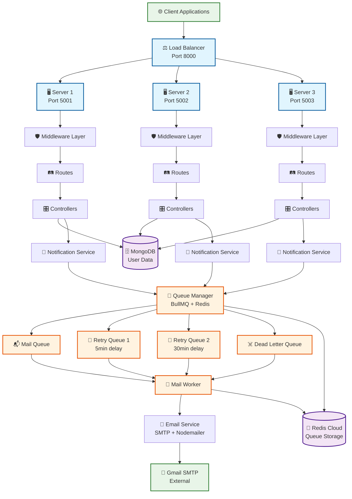

# 📋 Notification System Backend Architecture

## 🏗️ System Overview
A **distributed notification system** built with Node.js, Express, MongoDB, Redis, and BullMQ featuring load balancing, email processing, and comprehensive delivery tracking.

---

## 📁 Directory Structure

```
backend/
├── 📂 config/
│   ├── db.js                    # MongoDB connection configuration
│   └── index.js                 # Central configuration (Redis, servers, queues)
│
├── 📂 constants/
│   └── index.js                 # System constants (statuses, types, enums)
│
├── 📂 controllers/
│   ├── friendRequest.controller.js
│   ├── login.controller.js
│   ├── purchase.controller.js
│   ├── resetPassword.controller.js
│   └── signup.controller.js     # Main signup logic with email tracking
│
├── 📂 load-balancer/
│   └── server.js                # Load balancer with round-robin distribution
│
├── 📂 middleware/
│   ├── auth.js                  # Authentication & request preprocessing
│   ├── errorHandler.js          # Global error handling
│   └── validation.js            # Request validation middleware
│
├── 📂 models/
│   ├── emailNotification.model.js  # Email delivery tracking
│   ├── friendRequests.model.js
│   ├── logins.model.js
│   ├── purchases.model.js
│   ├── resetPasswords.model.js
│   └── signups.model.js         # User signups with email status tracking
│
├── 📂 queues/
│   └── index.js                 # BullMQ queue management (mail, retry1, retry2, dlq)
│
├── 📂 routes/
│   ├── friendRequest.routes.js
│   ├── health.routes.js         # Health check endpoints
│   ├── index.js                 # Route aggregation
│   ├── login.routes.js
│   ├── purchase.routes.js
│   ├── resetPassword.routes.js
│   └── signup.routes.js
│
├── 📂 servers/
│   ├── server1.js               # Backend server instance 1
│   ├── server2.js               # Backend server instance 2
│   └── server3.js               # Backend server instance 3
│
├── 📂 services/
│   ├── emailService.js          # SMTP email delivery service
│   └── notificationService.js   # Core notification orchestration
│
├── 📂 utils/
│   └── logger.js                # Centralized logging utility
│
├── 📂 workers/
│   └── mailWorker.js            # BullMQ email processing worker
│
├── .env                         # Environment configuration
├── package.json                 # Dependencies and scripts
└── ARCHITECTURE.md              # This documentation
```

---

## 🏛️ System Architecture Diagram



---

## 🔄 Data Flow Architecture

### 1. **Request Processing Flow**
```
Client Request → Load Balancer → Server Instance → Middleware → Routes → Controllers → Models → Database
```

### 2. **Notification Processing Flow**
```
Controller → Notification Service → Queue Manager → Mail Queue → Mail Worker → Email Service → SMTP → Delivery
```

### 3. **Retry Mechanism Flow**
```
Failed Email → Retry Queue 1 (5min) → Retry Queue 2 (30min) → Dead Letter Queue → Manual Review
```

---

## 🗃️ Database Schema

### **MongoDB Collections**

#### **Signups Collection**
```javascript
{
  userId: Number,           // Unique user identifier
  username: String,         // User's chosen username
  email: String,           // User's email address
  password: String,        // Hashed password
  emailVerified: Boolean,  // Email verification status
  welcomeEmail: {          // Email tracking object
    status: String,        // pending|queued|sending|delivered|failed
    attempts: Number,      // Delivery attempt count
    messageId: String,     // Email message ID
    deliveryHistory: []    // Complete delivery audit trail
  },
  createdAt: Date,
  updatedAt: Date
}
```

#### **EmailNotification Collection**
```javascript
{
  type: String,            // signup|login|reset_password|purchase|friend_request
  recipient: Object,       // Email recipient details
  status: String,          // pending|processing|delivered|failed
  attempts: Number,        // Delivery attempts
  retryHistory: [],        // Retry tracking
  messageId: String,       // SMTP message ID
  createdAt: Date
}
```

---

## 🔧 Key Technologies

| Technology | Purpose | Configuration |
|------------|---------|---------------|
| **Node.js + Express** | Web framework | 3 server instances |
| **MongoDB + Mongoose** | Database | User data & tracking |
| **Redis Cloud** | Queue storage | BullMQ backend |
| **BullMQ** | Job queue system | Mail processing |
| **Nodemailer** | Email delivery | Gmail SMTP |
| **Load Balancer** | Traffic distribution | Round-robin |

---

## ⚡ Key Features

### **🔄 Queue Architecture**
- **Mail Queue**: Primary email processing
- **Retry Queue 1**: 5-minute delayed retries  
- **Retry Queue 2**: 30-minute delayed retries
- **Dead Letter Queue**: Failed message handling

### **📊 Email Tracking**
- Real-time delivery status updates
- Complete delivery history audit trail
- Failure reason tracking
- SMTP response logging

### **🚀 High Availability**
- Load-balanced across 3 server instances
- Shared Redis connection pooling
- Graceful error handling and recovery
- Health monitoring endpoints

### **🔒 Security Features**
- Input validation and sanitization
- Error handling middleware
- Request logging and monitoring
- Server identification headers

---

## 🚦 API Endpoints

### **Health & Monitoring**
```
GET  /api/health                    # System health check
GET  /api/signups/statistics        # Signup analytics
GET  /api/signups/welcome-emails/failed   # Failed email tracking
```

### **Core Operations**
```
POST /api/signups                   # Create new user signup
GET  /api/signups                   # List signups with pagination
POST /api/signups/verify/:token     # Email verification
GET  /api/signups/:id/welcome-email-status # Email delivery status
```

### **Other Services**
```
POST /api/logins                    # User login tracking
POST /api/reset-passwords           # Password reset requests
POST /api/purchases                 # Purchase notifications
POST /api/friend-requests           # Social features
```

---

## 🔧 Configuration

### **Environment Variables**
```bash
# Database
MONGODB_URI=mongodb://localhost:27017/notification_system

# Redis Configuration
REDIS_HOST=redis-18008.c15.us-east-1-2.ec2.redns.redis-cloud.com
REDIS_PORT=18008
REDIS_USERNAME=default
REDIS_PASSWORD=***

# Email Service
EMAIL_HOST=smtp.gmail.com
EMAIL_USER=***@gmail.com
EMAIL_PASSWORD=***

# Server Ports
LOAD_BALANCER_PORT=8000
SERVER1_PORT=5001
SERVER2_PORT=5002
SERVER3_PORT=5003
```

---

## 🏃‍♂️ Running the System

### **Development Mode**
```bash
npm run dev          # Start all services with nodemon
npm run balancer     # Load balancer only
npm run server1      # Individual server instances
```

### **Production Mode**
```bash
npm start           # Load balancer only
npm run start:all   # All services
```

---

## 📈 Performance Metrics

- **Connection Efficiency**: 6 Redis connections (down from 15)
- **Email Processing**: 5 emails/second per worker
- **Queue Concurrency**: 2 workers per server
- **Load Distribution**: Round-robin across 3 servers
- **Retry Strategy**: 4-tier escalation system

---

## 🔄 Recent Optimizations

1. **Redis Connection Pooling**: Reduced connections by 60%
2. **Shared Worker Architecture**: Single worker per server
3. **Enhanced Email Tracking**: Complete delivery audit trails
4. **Improved Error Handling**: Graceful degradation
5. **Load Balancer Health Checks**: Automatic failover

---

*This architecture supports high-throughput email processing with comprehensive tracking and monitoring capabilities.*